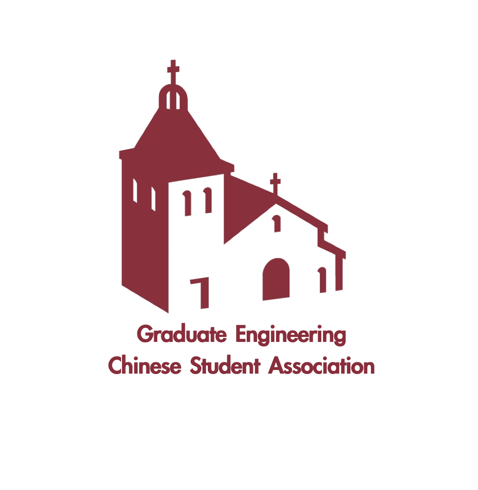
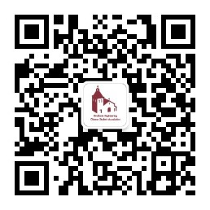

# SCU CSA Guidebook

> 阅读指南
> 1. 如果有疑问，请先参考并仔细阅读之前的issue
> 2. 如果问题之前没有被解答，可以开一个新的issue，并复制链接，把问题一起发到群里

## **Study at SCU**

### College of Arts and Sciences

### Leavey School of Business

### School of Education and Counseling Psychology

### **School of Engineering**

* [2021-2022 Academic Calendar School of Engineering](https://www.scu.edu/media/school-of-engineering/pdfs/graduate-engineering/2021-2022-GRADUATE-ENGR-ACADEMIC-CALENDAR.pdf)

### **School of Law**

### **选课**

* 选课顺序

  选课顺序：即将毕业学生在前，新生在后，PhD最后。

### **学校其他相关事项**

* 学校保险及Waive注意事项

  * 学校保险是否可以Waive？
  
    学校保险除非在美国有直系亲属，学生作为dependent被亲属的保险覆盖，才可以向学校申请Waive，其余情况不可以更换或者Waive。详情参考：https://www.scu.edu/cowell/insurance/

* 学校疫苗接种要求

  * [2021 Santa Clara University Immunization Requirements](https://www.scu.edu/media/offices/cowell-center/pdf/immunizations/Santa-Clara-University-Immunization-Requirements-6.2021.pdf)

## **Job Hunting at SCU**

### **刷题&面试技巧**

### **实习分享**

## **Life at SCU**

### **学校宿舍**

### **租房**

### **课外活动**

### **电话卡 & 移动运营商**

选择移动运营商之前，请先阅读 [如何选择移动运营商及套餐](https://www.uscreditcardguide.com/how-to-choose-your-wireless-provider-and-plan/) 和[issue #4](https://github.com/elviswxy/SCU_CSA_Guidebook/issues/4)

关于Google Voice
>  - Google Voice注册时需要一个额外的号码作为验证，这个号码可以在淘宝上买
>  - Google Voice注册完成后自动生成一个新号号码，只要能翻墙，这个号码就可以收发短信接打电话

[@mementolim](https://github.com/elviswxy/SCU_CSA_Guidebook/issues/4#issue-941193692): 在国内可以购买美国手机卡么？能够收到美国的电话么？飞机降落之后可以直接使用套餐里的流量么？哪个运营商比较推荐呢？
> - 淘宝可以买到，只要在国内能收短信，就可以用买到的号码注册Google Voice。简历上可填写Google Voice的号码
> - 美国的号码是可以在运营商之间随意转换的，操作比较简单
> - 买手机卡之前最好查一下自己的手机是否兼容对应运营商的网络 

### **二手车 & 驾照**

* 加州笔试每场容易预约，路考可能个人预约会需要排队，如果想尽快预约，也可以找一些第三方预约的人员，他们专门做带你熟悉考试路线以及预约路考的生意。

* CA 驾照考试过程可参考：[这里](https://www.guruin.com/articles/611)

* 网上CA笔试题目可参考：[美国加州驾照笔试模拟题（2021版）](https://pass-dmv-test.com/quiz-1-zh.html)

* DMV 最近营业时间

    星期六	休息
    星期日	休息
    星期一	07:00–17:00
    星期二	07:00–17:00
    星期三	09:00–17:00
    星期四	07:00–17:00
    星期五	07:00–17:00

# **关于我们**

## **GECSA**

## **免责声明**

* 本页面提供的所有信息内容仅供用户参考与交流，不构成商业建议或其他实际的操作意见。
* 用户在该页面发表的内容仅表明其个人的立场和观点，并不代表我们的立场或观点。
* 本页面内容如果有和**Santa Clara University**相关政策或建议有冲突的地方，请同学们以学校建议为准。
